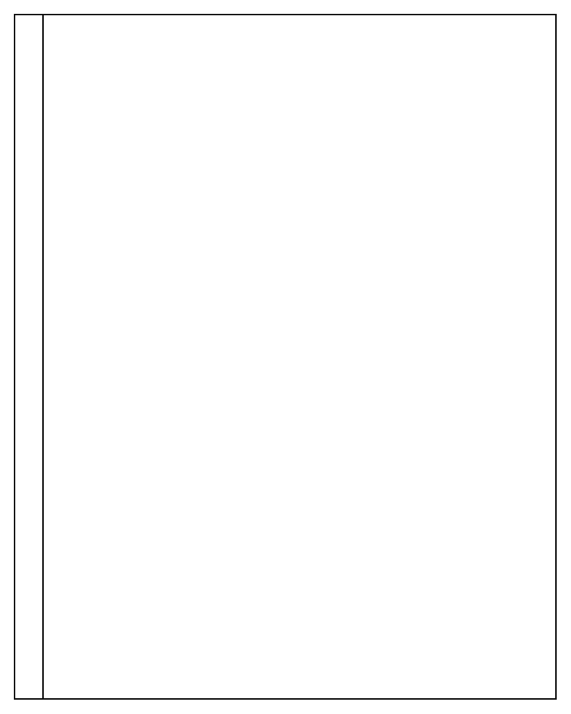

# Vertical Pool 2

## Definition

```
{
  _style: { 
    entity: 'swimlane;childLayout=stackLayout;resizeParent=1;resizeParentMax=0;startSize=20;horizontal=0;horizontalStack=1;',
  },
  _width: 380,
  _height: 480,
}
```

## Usage

```
import { VerticalPool2 } from '@diac/standard-components-diagrams/advanced'

<VerticalPool2/>
```

## Preview


