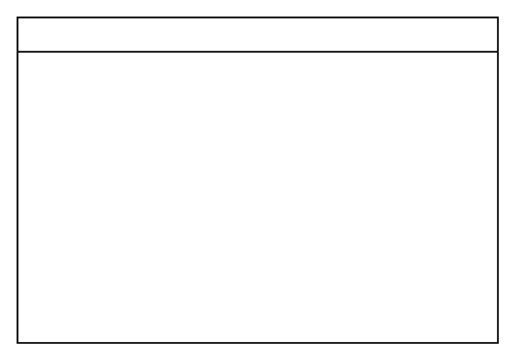

# Vertical Tree Layout

## Definition

```
{
  _style: { 
    entity: 'swimlane;startSize=20;horizontal=1;childLayout=treeLayout;horizontalTree=0;sortEdges=1;resizable=0;containerType=tree;fontSize=12;',
  },
  _original_width: 280,
  _original_height: 190,
}
```

## Usage

```
import { VerticalTreeLayout } from '@diac/standard-components-diagrams/advanced'

<VerticalTreeLayout/>
```

## Preview


