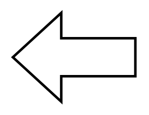

# Arrow Left

## Definition

```
{
  _style: 'shape=mxgraph.arrows.arrow_left;html=1;verticalLabelPosition=bottom;verticalAlign=top;strokeWidth=2;strokeColor=#000000;',
  _width: 97,
  _height: 70,
}
```

## Usage

```
import { ArrowLeft } from '@reactiac/standard-components-diagrams/arrows'

<ArrowLeft/>
```

## Preview


