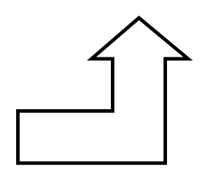

# Bent Up Arrow

## Definition

```
{
  _style: 'shape=mxgraph.arrows.bent_up_arrow;html=1;verticalLabelPosition=bottom;verticalAlign=top;strokeWidth=2;strokeColor=#000000;',
  _width: 97,
  _height: 83,
}
```

## Usage

```
import { BentUpArrow } from '@reactiac/standard-components-diagrams/arrows'

<BentUpArrow/>
```

## Preview


