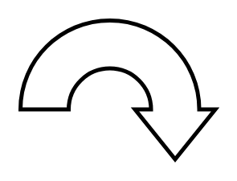

# Circular Arrow

## Definition

```
{
  _style: 'shape=mxgraph.arrows.circular_arrow;html=1;verticalLabelPosition=bottom;verticalAlign=top;strokeWidth=2;strokeColor=#000000;',
  _width: 97,
  _height: 69,
}
```

## Usage

```
import { CircularArrow } from '@reactiac/standard-components-diagrams/arrows'

<CircularArrow/>
```

## Preview


