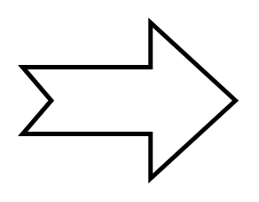

# Right Notched Arrow

## Definition

```
{
  _style: 'shape=mxgraph.arrows.right_notched_arrow;html=1;verticalLabelPosition=bottom;verticalAlign=top;strokeWidth=2;strokeColor=#000000;',
  _width: 96,
  _height: 70,
}
```

## Usage

```
import { RightNotchedArrow } from '@diac/standard-components-diagrams/arrows'

<RightNotchedArrow/>
```

## Preview


