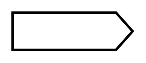

# Signal-in Arrow

## Definition

```
{
  _style: 'shape=mxgraph.arrows.signal-in_arrow;html=1;verticalLabelPosition=bottom;verticalAlign=top;strokeWidth=2;strokeColor=#000000;',
  _width: 97,
  _height: 30,
}
```

## Usage

```
import { SignalInArrow } from '@diac/standard-components-diagrams/arrows'

<SignalInArrow/>
```

## Preview


