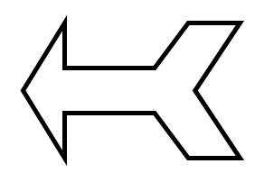

# Slender Wide Tailed Arrow

## Definition

```
{
  _style: { 
    entity: 'shape=mxgraph.arrows.slender_wide_tailed_arrow;html=1;verticalLabelPosition=bottom;verticalAlign=top;strokeWidth=2;strokeColor=#000000;',
  },
  _original_width: 96,
  _original_height: 60,
}
```

## Usage

```
import { SlenderWideTailedArrow } from '@diac/standard-components-diagrams/arrows'

<SlenderWideTailedArrow/>
```

## Preview


