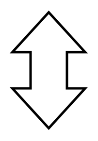

# Two Way Arrow Vertical

## Definition

```
{
  _style: 'shape=mxgraph.arrows.two_way_arrow_vertical;html=1;verticalLabelPosition=bottom;verticalAlign=top;strokeWidth=2;strokeColor=#000000;',
  _width: 60,
  _height: 96,
}
```

## Usage

```
import { TwoWayArrowVertical } from '@diac/standard-components-diagrams/arrows'

<TwoWayArrowVertical/>
```

## Preview


