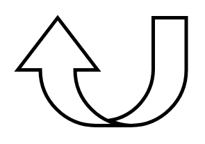

# U Turn Up Arrow

## Definition

```
{
  _style: { 
    entity: 'shape=mxgraph.arrows.u_turn_up_arrow;html=1;verticalLabelPosition=bottom;verticalAlign=top;strokeWidth=2;strokeColor=#000000;',
  },
  _width: 97,
  _height: 62,
}
```

## Usage

```
import { UTurnUpArrow } from '@diac/standard-components-diagrams/arrows'

<UTurnUpArrow/>
```

## Preview


