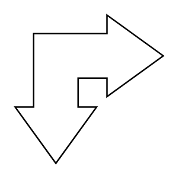

# Bend Double Arrow

## Definition

```
{
  _style: { 
    entity: 'html=1;shadow=0;dashed=0;align=center;verticalAlign=middle;shape=mxgraph.arrows2.bendDoubleArrow;dy=15;dx=38;arrowHead=55;rounded=0;',
  },
  _original_width: 100,
  _original_height: 100,
}
```

## Usage

```
import { BendDoubleArrow } from '@diac/standard-components-diagrams/arrows2'

<BendDoubleArrow/>
```

## Preview


