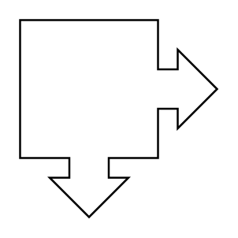

# Callout with Double Arrow 90°

## Definition

```
{
  _style: 'html=1;shadow=0;dashed=0;align=center;verticalAlign=middle;shape=mxgraph.arrows2.calloutDouble90Arrow;dy1=10;dx1=20;dx2=70;dy2=70;arrowHead=10;',
  _width: 60,
  _height: 60,
}
```

## Usage

```
import { CalloutWithDoubleArrow90 } from '@diac/standard-components-diagrams/arrows2'

<CalloutWithDoubleArrow90/>
```

## Preview


