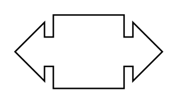

# Callout with Double Arrow

## Definition

```
{
  _style: { 
    entity: 'html=1;shadow=0;dashed=0;align=center;verticalAlign=middle;shape=mxgraph.arrows2.calloutDoubleArrow;dy=10;dx=20;notch=24;arrowHead=10;',
  },
  _original_width: 100,
  _original_height: 50,
}
```

## Usage

```
import { CalloutWithDoubleArrow } from '@diac/standard-components-diagrams/arrows2'

<CalloutWithDoubleArrow/>
```

## Preview


