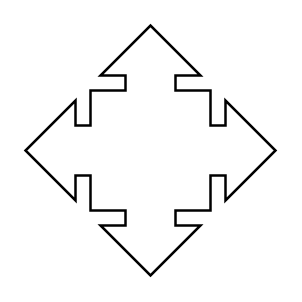

# Callout with Quad Arrow

## Definition

```
{
  _style: 'html=1;shadow=0;dashed=0;align=center;verticalAlign=middle;shape=mxgraph.arrows2.calloutQuadArrow;dy=10;dx=20;notch=24;arrowHead=10;',
  _width: 100,
  _height: 100,
}
```

## Usage

```
import { CalloutWithQuadArrow } from '@reactiac/standard-components-diagrams/arrows2'

<CalloutWithQuadArrow/>
```

## Preview


