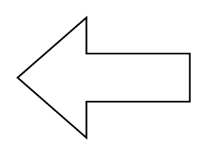
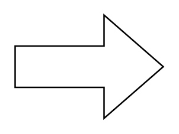
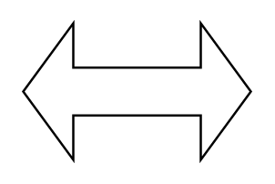

# Arrows Arrows2 Entities

- [ArrowDown](./arrow-down.md)  

- [ArrowLeft](./arrow-left.md)  

- [ArrowRight](./arrow-right.md)  

- [ArrowUp](./arrow-up.md)  

- [BendArrow](./bend-arrow.md)  

- [BendArrowRounded](./bend-arrow-rounded.md)  

- [BendDoubleArrow](./bend-double-arrow.md)  

- [BendDoubleArrow2](./bend-double-arrow-2.md)  

- [CalloutWithArrow](./callout-with-arrow.md)  

- [CalloutWithDoubleArrow](./callout-with-double-arrow.md)  

- [CalloutWithDoubleArrow90](./callout-with-double-arrow-90.md)  

- [CalloutWithQuadArrow](./callout-with-quad-arrow.md)  

- [ChevronArrow](./chevron-arrow.md)  

- [JumpInArrow](./jump-in-arrow.md)  

- [NotchedArrow](./notched-arrow.md)  

- [NotchedSignalInArrow](./notched-signal-in-arrow.md)  

- [QuadArrow](./quad-arrow.md)  

- [SharpArrow](./sharp-arrow.md)  

- [SharpArrow2](./sharp-arrow-2.md)  

- [SignalInArrow](./signal-in-arrow.md)  

- [SlenderArrow](./slender-arrow.md)  

- [SlenderTwoWayArrow](./slender-two-way-arrow.md)  

- [StripedArrow](./striped-arrow.md)  

- [StylisedArrow](./stylised-arrow.md)  

- [TailedArrow](./tailed-arrow.md)  

- [TailedArrowWithNotch](./tailed-arrow-with-notch.md)  

- [TriadArrow](./triad-arrow.md)  

- [TwoWayArrow](./two-way-arrow.md)  

- [UTurnArrow](./u-turn-arrow.md)  

