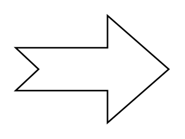

# Notched Arrow

## Definition

```
{
  _style: 'html=1;shadow=0;dashed=0;align=center;verticalAlign=middle;shape=mxgraph.arrows2.arrow;dy=0.6;dx=40;notch=15;',
  _width: 100,
  _height: 70,
}
```

## Usage

```
import { NotchedArrow } from '@reactiac/standard-components-diagrams/arrows2'

<NotchedArrow/>
```

## Preview


