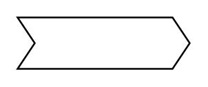

# Notched Signal-In Arrow

## Definition

```
{
  _style: { 
    entity: 'html=1;shadow=0;dashed=0;align=center;verticalAlign=middle;shape=mxgraph.arrows2.arrow;dy=0;dx=10;notch=10;',
  },
  _original_width: 100,
  _original_height: 30,
}
```

## Usage

```
import { NotchedSignalInArrow } from '@dinghy/standard-components-diagrams/arrows2'

<NotchedSignalInArrow/>
```

## Preview


