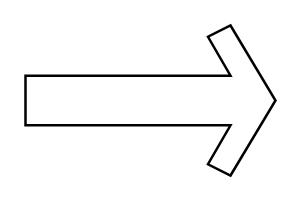

# Sharp Arrow 2

## Definition

```
{
  _style: { 
    entity: 'html=1;shadow=0;dashed=0;align=center;verticalAlign=middle;shape=mxgraph.arrows2.sharpArrow2;dy1=0.67;dx1=18;dx2=18;dy3=0.15;dx3=27;notch=0;',
  },
  _original_width: 100,
  _original_height: 60,
}
```

## Usage

```
import { SharpArrow2 } from '@diac/standard-components-diagrams/arrows2'

<SharpArrow2/>
```

## Preview


