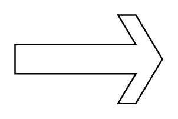

# Sharp Arrow

## Definition

```
{
  _style: 'html=1;shadow=0;dashed=0;align=center;verticalAlign=middle;shape=mxgraph.arrows2.sharpArrow;dy1=0.67;dx1=18;dx2=18;notch=0;',
  _width: 100,
  _height: 60,
}
```

## Usage

```
import { SharpArrow } from '@diac/standard-components-diagrams/arrows2'

<SharpArrow/>
```

## Preview


