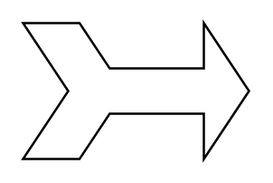

# Tailed Arrow with Notch

## Definition

```
{
  _style: 'html=1;shadow=0;dashed=0;align=center;verticalAlign=middle;shape=mxgraph.arrows2.tailedNotchedArrow;dy1=10;dx1=20;notch=20;arrowHead=20;dx2=25;dy2=30;',
  _width: 100,
  _height: 60,
}
```

## Usage

```
import { TailedArrowWithNotch } from '@diac/standard-components-diagrams/arrows2'

<TailedArrowWithNotch/>
```

## Preview


