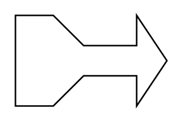

# Tailed Arrow

## Definition

```
{
  _style: { 
    entity: 'html=1;shadow=0;dashed=0;align=center;verticalAlign=middle;shape=mxgraph.arrows2.tailedArrow;dy1=10;dx1=20;notch=0;arrowHead=20;dx2=25;dy2=30;',
  },
  _original_width: 100,
  _original_height: 60,
}
```

## Usage

```
import { TailedArrow } from '@dinghy/standard-components-diagrams/arrows2'

<TailedArrow/>
```

## Preview


