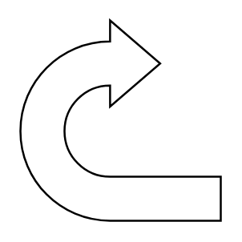

# U Turn Arrow

## Definition

```
{
  _style: 'html=1;shadow=0;dashed=0;align=center;verticalAlign=middle;shape=mxgraph.arrows2.uTurnArrow;dy=11;arrowHead=43;dx2=25;',
  _width: 60,
  _height: 60,
}
```

## Usage

```
import { UTurnArrow } from '@diac/standard-components-diagrams/arrows2'

<UTurnArrow/>
```

## Preview


