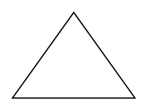

# Acute Triangle

## Definition

```
{
  _style: 'verticalLabelPosition=bottom;verticalAlign=top;html=1;shape=mxgraph.basic.acute_triangle;dx=0.5;',
  _width: 100,
  _height: 70,
}
```

## Usage

```
import { AcuteTriangle } from '@diac/standard-components-diagrams/basic'

<AcuteTriangle/>
```

## Preview


