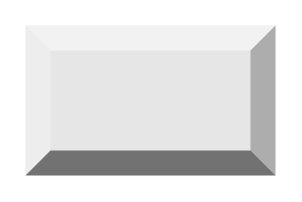

# Button (shaded)

## Definition

```
{
  _style: 'labelPosition=center;verticalLabelPosition=middle;align=center;html=1;shape=mxgraph.basic.shaded_button;dx=10;fillColor=#E6E6E6;strokeColor=none;whiteSpace=wrap;',
  _width: 100,
  _height: 60,
}
```

## Usage

```
import { ButtonShaded } from '@reactiac/standard-components-diagrams/basic'

<ButtonShaded/>
```

## Preview


