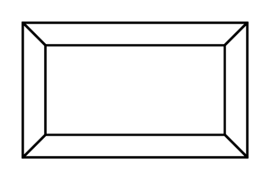

# Button

## Definition

```
{
  _style: { 
    entity: 'labelPosition=center;verticalLabelPosition=middle;align=center;html=1;shape=mxgraph.basic.button;dx=10;whiteSpace=wrap;',
  },
  _original_width: 100,
  _original_height: 60,
}
```

## Usage

```
import { Button } from '@dinghy/standard-components-diagrams/basic'

<Button/>
```

## Preview


