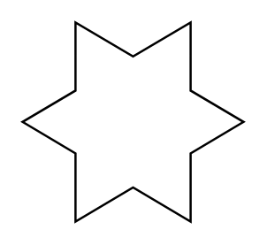

# 6 Point Star

## Definition

```
{
  _style: 'verticalLabelPosition=bottom;verticalAlign=top;html=1;shape=mxgraph.basic.6_point_star',
  _width: 100,
  _height: 90,
}
```

## Usage

```
import { Component6PointStar } from '@diac/standard-components-diagrams/basic'

<Component6PointStar/>
```

## Preview


