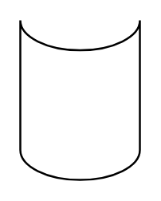

# Cylinder Stack

## Definition

```
{
  _style: { 
    entity: 'shape=cylinder3;whiteSpace=wrap;html=1;boundedLbl=1;backgroundOutline=1;size=15;lid=0;',
  },
  _width: 60,
  _height: 80,
}
```

## Usage

```
import { CylinderStack } from '@diac/standard-components-diagrams/basic'

<CylinderStack/>
```

## Preview


