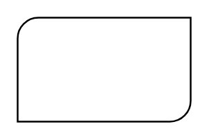

# Diagonal Rounded Rectangle

## Definition

```
{
  _style: { 
    entity: 'verticalLabelPosition=bottom;verticalAlign=top;html=1;shape=mxgraph.basic.diag_round_rect;dx=6;whiteSpace=wrap;',
  },
  _original_width: 100,
  _original_height: 60,
}
```

## Usage

```
import { DiagonalRoundedRectangle } from '@diac/standard-components-diagrams/basic'

<DiagonalRoundedRectangle/>
```

## Preview


