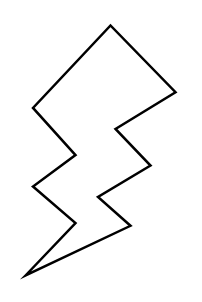

# Flash

## Definition

```
{
  _style: 'verticalLabelPosition=bottom;verticalAlign=top;html=1;shape=mxgraph.basic.flash',
  _width: 60,
  _height: 100,
}
```

## Usage

```
import { Flash } from '@reactiac/standard-components-diagrams/basic'

<Flash/>
```

## Preview


