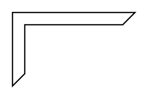

# Frame Corner

## Definition

```
{
  _style: 'verticalLabelPosition=bottom;verticalAlign=top;html=1;shape=mxgraph.basic.frame_corner;dx=10;whiteSpace=wrap;',
  _width: 100,
  _height: 60,
}
```

## Usage

```
import { FrameCorner } from '@reactiac/standard-components-diagrams/basic'

<FrameCorner/>
```

## Preview


