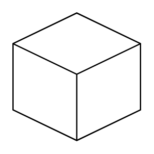

# Isometric Cube

## Definition

```
{
  _style: { 
    entity: 'html=1;shape=mxgraph.basic.isocube;isoAngle=15;',
  },
  _original_width: 100,
  _original_height: 100,
}
```

## Usage

```
import { IsometricCube } from '@diac/standard-components-diagrams/basic'

<IsometricCube/>
```

## Preview


