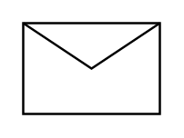

# Message

## Definition

```
{
  _style: 'shape=message;html=1;html=1;outlineConnect=0;labelPosition=center;verticalLabelPosition=bottom;align=center;verticalAlign=top;',
  _width: 60,
  _height: 40,
}
```

## Usage

```
import { Message } from '@reactiac/standard-components-diagrams/basic'

<Message/>
```

## Preview


