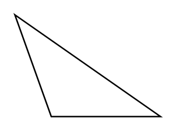

# Obtuse Triangle

## Definition

```
{
  _style: 'verticalLabelPosition=bottom;verticalAlign=top;html=1;shape=mxgraph.basic.obtuse_triangle;dx=0.25;',
  _width: 100,
  _height: 70,
}
```

## Usage

```
import { ObtuseTriangle } from '@reactiac/standard-components-diagrams/basic'

<ObtuseTriangle/>
```

## Preview


