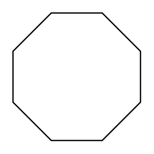

# Octagon

## Definition

```
{
  _style: 'whiteSpace=wrap;html=1;shape=mxgraph.basic.octagon2;align=center;verticalAlign=middle;dx=15;',
  _width: 60,
  _height: 60,
}
```

## Usage

```
import { Octagon } from '@diac/standard-components-diagrams/basic'

<Octagon/>
```

## Preview


