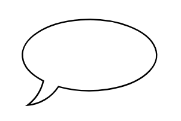

# Oval Callout

## Definition

```
{
  _style: { 
    entity: 'whiteSpace=wrap;html=1;shape=mxgraph.basic.oval_callout',
  },
  _original_width: 100,
  _original_height: 60,
}
```

## Usage

```
import { OvalCallout } from '@diac/standard-components-diagrams/basic'

<OvalCallout/>
```

## Preview


