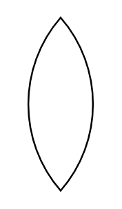

# Pointed Oval

## Definition

```
{
  _style: { 
    entity: 'whiteSpace=wrap;html=1;shape=mxgraph.basic.pointed_oval',
  },
  _original_width: 50,
  _original_height: 100,
}
```

## Usage

```
import { PointedOval } from '@diac/standard-components-diagrams/basic'

<PointedOval/>
```

## Preview


