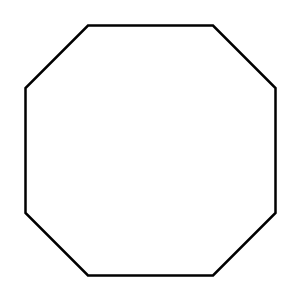

# Polygon

## Definition

```
{
  _style: 'verticalLabelPosition=bottom;verticalAlign=top;html=1;shape=mxgraph.basic.polygon;polyCoords=[[0.25,0],[0.75,0],[1,0.25],[1,0.75],[0.75,1],[0.25,1],[0,0.75],[0,0.25]];polyline=0;',
  _width: 100,
  _height: 100,
}
```

## Usage

```
import { Polygon } from '@reactiac/standard-components-diagrams/basic'

<Polygon/>
```

## Preview


