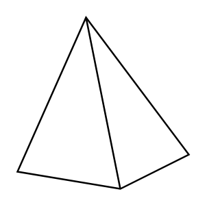

# Pyramid

## Definition

```
{
  _style: { 
    entity: 'verticalLabelPosition=bottom;verticalAlign=top;html=1;shape=mxgraph.basic.pyramid;dx1=0.4;dx2=0.6;dy1=0.9;dy2=0.8;',
  },
  _original_width: 100,
  _original_height: 100,
}
```

## Usage

```
import { Pyramid } from '@dinghy/standard-components-diagrams/basic'

<Pyramid/>
```

## Preview


