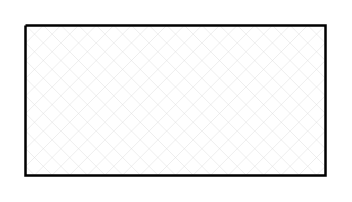

# Rectangle with diagonal grid fill

## Definition

```
{
  _style: { 
    entity: 'verticalLabelPosition=bottom;verticalAlign=top;html=1;shape=mxgraph.basic.patternFillRect;fillStyle=diagGrid;step=5;fillStrokeWidth=0.2;fillStrokeColor=#dddddd;',
  },
  _original_width: 120,
  _original_height: 60,
}
```

## Usage

```
import { RectangleWithDiagonalGridFill } from '@dinghy/standard-components-diagrams/basic'

<RectangleWithDiagonalGridFill/>
```

## Preview


