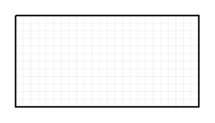

# Rectangle with grid fill

## Definition

```
{
  _style: { 
    entity: 'verticalLabelPosition=bottom;verticalAlign=top;html=1;shape=mxgraph.basic.patternFillRect;fillStyle=grid;step=5;fillStrokeWidth=0.2;fillStrokeColor=#dddddd;',
  },
  _original_width: 120,
  _original_height: 60,
}
```

## Usage

```
import { RectangleWithGridFill } from '@dinghy/standard-components-diagrams/basic'

<RectangleWithGridFill/>
```

## Preview


