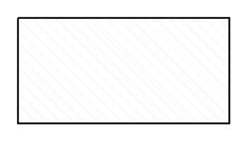

# Rectangle with reverse diagonal fill

## Definition

```
{
  _style: 'verticalLabelPosition=bottom;verticalAlign=top;html=1;shape=mxgraph.basic.patternFillRect;fillStyle=diagRev;step=5;fillStrokeWidth=0.2;fillStrokeColor=#dddddd;',
  _width: 120,
  _height: 60,
}
```

## Usage

```
import { RectangleWithReverseDiagonalFill } from '@diac/standard-components-diagrams/basic'

<RectangleWithReverseDiagonalFill/>
```

## Preview


