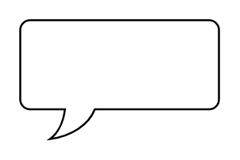

# Rounded Rectangular Callout

## Definition

```
{
  _style: 'whiteSpace=wrap;html=1;shape=mxgraph.basic.roundRectCallout;dx=30;dy=15;size=5;boundedLbl=1;',
  _width: 100,
  _height: 60,
}
```

## Usage

```
import { RoundedRectangularCallout } from '@diac/standard-components-diagrams/basic'

<RoundedRectangularCallout/>
```

## Preview


