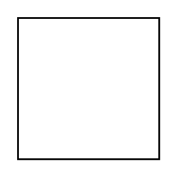

# Suit Man

## Definition

```
{
  _style: { 
    entity: 'image;html=1;image=img/lib/clip_art/people/Suit_Man_128x128.pngstrokeColor=none;',
  },
  _width: 60,
  _height: 60,
}
```

## Usage

```
import { SuitMan } from '@diac/standard-components-diagrams/clipartPeople'

<SuitMan/>
```

## Preview


