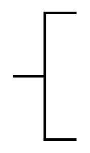

# Annotation 2

## Definition

```
{
  _style: { 
    entity: 'strokeWidth=2;html=1;shape=mxgraph.flowchart.annotation_2;align=left;labelPosition=right;pointerEvents=1;',
  },
  _original_width: 50,
  _original_height: 100,
}
```

## Usage

```
import { Annotation2 } from '@diac/standard-components-diagrams/flowchart'

<Annotation2/>
```

## Preview


