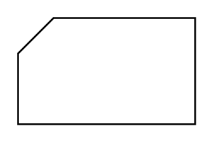

# Card

## Definition

```
{
  _style: { 
    entity: 'verticalLabelPosition=bottom;verticalAlign=top;html=1;shape=card;whiteSpace=wrap;size=20;arcSize=12;',
  },
  _original_width: 100,
  _original_height: 60,
}
```

## Usage

```
import { Card } from '@dinghy/standard-components-diagrams/flowchart'

<Card/>
```

## Preview


