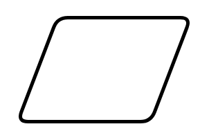

# Data

## Definition

```
{
  _style: 'shape=parallelogram;html=1;strokeWidth=2;perimeter=parallelogramPerimeter;whiteSpace=wrap;rounded=1;arcSize=12;size=0.23;',
  _width: 100,
  _height: 60,
}
```

## Usage

```
import { Data } from '@reactiac/standard-components-diagrams/flowchart'

<Data/>
```

## Preview


