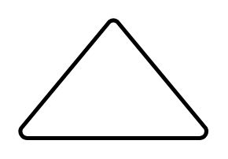

# Extract or Measurement

## Definition

```
{
  _style: { 
    entity: 'strokeWidth=2;html=1;shape=mxgraph.flowchart.extract_or_measurement;whiteSpace=wrap;',
  },
  _original_width: 95,
  _original_height: 60,
}
```

## Usage

```
import { ExtractOrMeasurement } from '@dinghy/standard-components-diagrams/flowchart'

<ExtractOrMeasurement/>
```

## Preview


