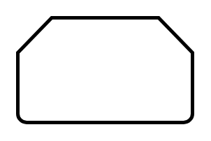

# Loop Limit

## Definition

```
{
  _style: { 
    entity: 'strokeWidth=2;html=1;shape=mxgraph.flowchart.loop_limit;whiteSpace=wrap;',
  },
  _width: 100,
  _height: 60,
}
```

## Usage

```
import { LoopLimit } from '@diac/standard-components-diagrams/flowchart'

<LoopLimit/>
```

## Preview


