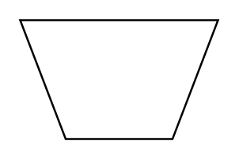

# Manual Operation

## Definition

```
{
  _style: 'verticalLabelPosition=middle;verticalAlign=middle;html=1;shape=trapezoid;perimeter=trapezoidPerimeter;whiteSpace=wrap;size=0.23;arcSize=10;flipV=1;labelPosition=center;align=center;',
  _width: 100,
  _height: 60,
}
```

## Usage

```
import { ManualOperation } from '@reactiac/standard-components-diagrams/flowchart'

<ManualOperation/>
```

## Preview


