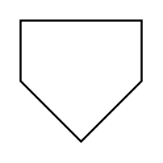

# Off-Page Reference

## Definition

```
{
  _style: 'verticalLabelPosition=bottom;verticalAlign=top;html=1;shape=offPageConnector;rounded=0;size=0.5;',
  _width: 60,
  _height: 60,
}
```

## Usage

```
import { OffPageReference } from '@reactiac/standard-components-diagrams/flowchart'

<OffPageReference/>
```

## Preview


